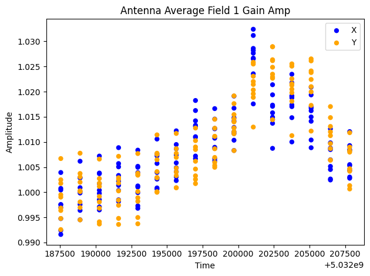
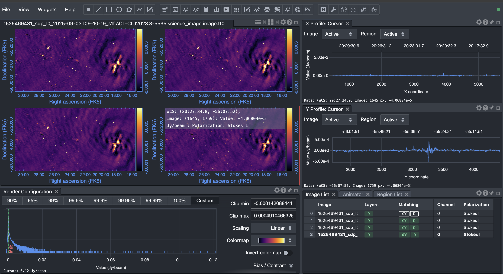
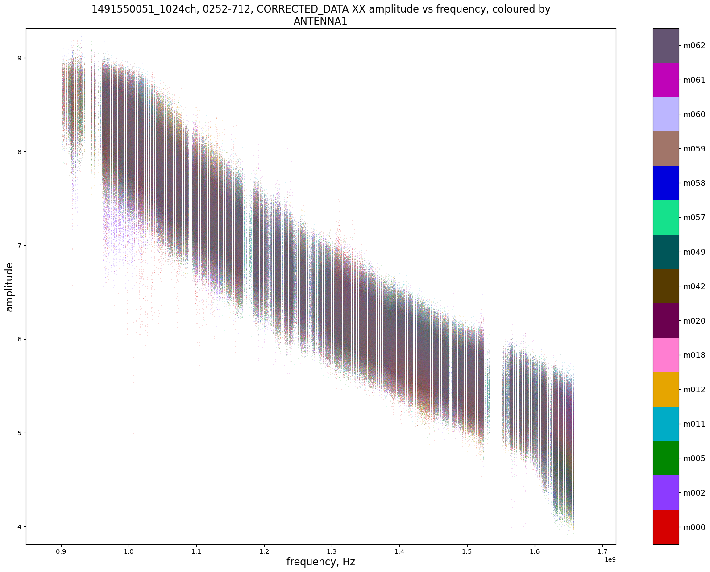
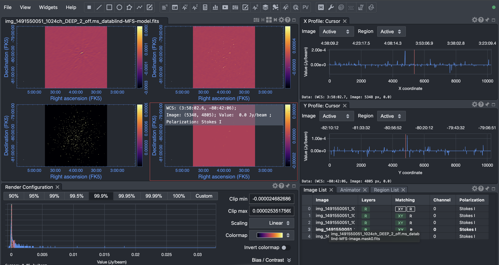
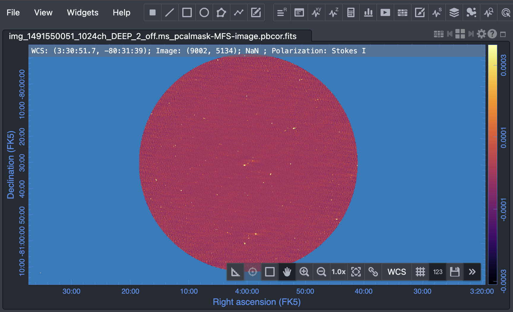

# ProcessMeerKAT Tutorial
This tutorial is designed to help you use the processMeerKAT Pipeline on the ilifu cluster, utilising public datasets from the [SARAO](https://archive.sarao.ac.za) archive. Details about the processMeerKAT pipeline can be found in the official [documentation](https://idia-pipelines.github.io/docs/processMeerKAT). We highly recommend reviewing these resources to gain a deeper understanding of the pipeline’s features and usage. The documentation is accompanied by a detailed [tutorial](https://idia-pipelines.github.io/docs/processMeerKAT/deep-2-tutorial/), which is invaluable for learning how to effectively process MeerKAT data.

In our case, however, we focus on a different dataset that presents some specific challenges, such as missing **fields** and **reference antenna** in the config file.

## Datasets
There are two public datasets available on ilifu at `/idia/data/public`: `1491550051` and `1525469431`.

- `1491550051` is a Measurement set (MS) featured in a processMeerKAT tutorial [here](https://idia-pipelines.github.io/docs/processMeerKAT/deep-2-tutorial/). Please refer to this resource for detailed information about the data. Note that the tutorial is based on **version 1.0**, while currently the pipeline is at version 2.0.
- `1525469431` is a MeerKAT observation of the massive galaxy cluster ACT-CL J2023.3-5535 in the L-Band. The name indicates its discovery by the Atacama Cosmology Telescope (ACT), with "CL" denoting "Cluster" and "J2023.3-5535" representing its sky coordinates (Right Ascension 20h 23m 18s, Declination -55° 35' 00"). For more background on this cluster, see [this paper](https://academic.oup.com/mnras/advance-article/doi/10.1093/mnras/staf1499/8250033).

Below is an image of this target in the UHF band:


Image source: [SARAO SDP+Pipeline+overview](https://skaafrica.atlassian.net/wiki/spaces/ESDKB/pages/338723406/SDP+pipelines+overview)

## Observation details
Before launching into the calibration process, it's crucial to understand the foundational details of your Measurement Set (MS). While the processMeerKAT pipeline is designed to automate many steps, manually verifying the observation parameters is highly recommended, and sometimes necessary, to ensure a successful calibration.

1. Data Access and Preliminary Information regarding your MeerKAT observations, such as scheduling and overall configuration, can be accessed through the SARAO Archive. However, for calibration purposes, we need to extract specific details directly from the MS itself.

2. The following information is vital for correctly configuring the processMeerKAT pipeline and addressing potential issues:

    - Antennas Present: The pipeline requires a reference antenna for phase calibration. By default, processMeerKAT is often configured to use M059.

    Action: You must verify which antennas are present in your specific dataset. If M059 is not included, you must manually select and specify a different antenna as the reference in the pipeline configuration file.

    - Correlations Available: You need to confirm the presence and type of correlations recorded (e.g., XX, YY, XY, YX). This ensures the correct polarization calibration can be applied.

    - Observed Fields (Target and Calibrators): You must clearly identify and confirm the Target Field(s), the Primary/Phase Calibrator, and the Flux Calibrator.

    Action: Double-check this list against the fields the processMeerKAT pipeline detects automatically. Discrepancies may indicate a metadata issue in the MS or an error in your expected observation list.

3. The Need for Manual Configuration: While processMeerKAT generates a configuration file based on the MS (which is a good starting point), you may need to manually update it. This is typically required when:
The default reference antenna (M059) is missing (as mentioned above).
You need to exclude flagged antennas or corrupted fields.

Specific tutorial steps (mentioned later) require non-default calibration settings.

Knowing the dataset specifics allows you to troubleshoot confidently and manually override the pipeline's defaults when the situation demands it.


## Lets Inspect the data with CASA interactively on ilifu
1. Log in to slurm-ilifu:  
```bash
ssh walter@slurm.ilifu.ac.za
```
2. Start an interactive session (the Devel partition is sufficient):
```bash
sinteractive
```
3. Navigate to your workspace for processing. Ideally, use `/scratch3/user` or `/scratch3/projects`. Then launch a CASA-stable container:
```bash
singularity shell /idia/software/containers/casa-stable-v6.7.0-31-py3.10-2025-04-08.sif
```
4. Start CASA and use the listobs() task to inspect your data. This task provides a summary of scans, frequency setup, source list, and antenna locations.
In the container shell, initialize CASA with:
```bash
casa
```
    **If CASA fails to start due to missing data, create the required directory and restart CASA** 
```bash
mkdir ~/.casa/data
casa
```
5. Initialize the listobs() task by running:
```bash
inp listobs
```
This will open the task interface (shown below) for further configuration.
```
Listobs -- Summary of a MeasurementSet and list it in the logger or in a file
vis            = ''                      # Name of input visibility file (MS)
selectdata     = True                    # Data selection parameters
spw         = ''                      # Selection based on
                                        # spectral-window/frequency/channel.
field       = ''                      # Selection based on field names or field
                                        # index numbers. Default is all.
antenna     = ''                      # Selection based on antenna/baselines.
                                        # Default is all.
uvrange     = ''                      # Selection based on uv range. Default: entire
                                        # range. Default units: meters.
timerange   = ''                      # Selection based on time range. Default is
                                        # entire range.
correlation = ''                      # Selection based on correlation. Default is
                                        # all.
scan        = ''                      # Selection based on scan numbers. Default is
                                        # all.
intent      = ''                      # Selection based on observation intent.
                                        # Default is all.
feed        = ''                      # Selection based on multi-feed numbers: Not
                                        # yet implemented
array       = ''                      # Selection based on (sub)array numbers.
                                        # Default is all.
observation = ''                      # Selection based on observation ID. Default
                                        # is all.
verbose        = True                    # Controls level of information detail
                                        # reported. True reports more than False.
listfile       = ''                      # Name of disk file to write output. Default
                                        # is none (output is written to logger only).
listunfl       = False                   # List unflagged row counts? If true, it can
                                        # have significant negative performance
                                        # impact.
cachesize      = 50.0                    # EXPERIMENTAL. Maximum size in megabytes of
                                        # cache in which data structures can be held.
```
6. Then point the task to the correct MS: 
```bash
vis = /idia/data/public/1525469431/1525469431_sdp_l0.ms
``` 
and also provide an output file:
```bash
listfile = details_1525469431.txt
```
7. Once all that is setup we can run the listobs task with command `go`.

    We can now inspect details about our observation in the `details_1525469431.txt` which should be similar to the output below.

    ```bash
    ================================================================================
            MeasurementSet Name:  /idia/data/public/1525469431/1525469431_sdp_l0.ms      MS Version 2
    ================================================================================
    Observer: Tony     Project: 20180504-0015
    Observation: MeerKAT
    Data records: 630840       Total elapsed time = 21606.9 seconds
    Observed from   04-May-2018/21:31:15.6   to   05-May-2018/03:31:22.5 (UTC)

    ObservationID = 0         ArrayID = 0
    Date        Timerange (UTC)          Scan  FldId FieldName             nRows     SpwIds   Average Interval(s)    ScanIntent
    04-May-2018/21:31:15.6 - 21:51:11.1     1      0 ACT-CLJ2023.3-5535       35880  [0]  [4] [TARGET]
                21:51:31.1 - 21:53:27.1     2      1 J1939-6342                3480  [0]  [4] [CALIBRATE_AMPLI,CALIBRATE_PHASE]
                21:53:47.1 - 22:13:42.6     3      0 ACT-CLJ2023.3-5535       35880  [0]  [4] [TARGET]
                22:14:02.6 - 22:16:02.5     4      1 J1939-6342                3600  [0]  [4] [CALIBRATE_AMPLI,CALIBRATE_PHASE]
                22:16:22.5 - 22:36:18.0     5      0 ACT-CLJ2023.3-5535       35880  [0]  [4] [TARGET]
                22:36:38.0 - 22:38:33.9     6      1 J1939-6342                3480  [0]  [4] [CALIBRATE_AMPLI,CALIBRATE_PHASE]
                22:38:53.9 - 22:58:49.4     7      0 ACT-CLJ2023.3-5535       35880  [0]  [4] [TARGET]
                22:59:05.4 - 23:01:05.4     8      1 J1939-6342                3600  [0]  [4] [CALIBRATE_AMPLI,CALIBRATE_PHASE]
                23:01:21.4 - 23:21:20.8     9      0 ACT-CLJ2023.3-5535       36000  [0]  [4] [TARGET]
                23:21:36.8 - 23:23:32.8    10      1 J1939-6342                3480  [0]  [4] [CALIBRATE_AMPLI,CALIBRATE_PHASE]
                23:23:52.8 - 23:43:48.3    11      0 ACT-CLJ2023.3-5535       35880  [0]  [4] [TARGET]
                23:44:04.3 - 23:46:00.2    12      1 J1939-6342                3480  [0]  [4] [CALIBRATE_AMPLI,CALIBRATE_PHASE]
                23:46:20.2 - 00:06:15.7    13      0 ACT-CLJ2023.3-5535       35880  [0]  [4] [TARGET]
    05-May-2018/00:06:35.7 - 00:08:31.6    14      1 J1939-6342                3480  [0]  [4] [CALIBRATE_AMPLI,CALIBRATE_PHASE]
                00:08:47.6 - 00:28:47.1    15      0 ACT-CLJ2023.3-5535       36000  [0]  [4] [TARGET]
                00:29:03.1 - 00:31:03.1    16      1 J1939-6342                3600  [0]  [4] [CALIBRATE_AMPLI,CALIBRATE_PHASE]
                00:31:19.1 - 00:51:14.6    17      0 ACT-CLJ2023.3-5535       35880  [0]  [4] [TARGET]
                00:51:34.6 - 00:53:30.5    18      1 J1939-6342                3480  [0]  [4] [CALIBRATE_AMPLI,CALIBRATE_PHASE]
                00:53:50.5 - 01:13:46.0    19      0 ACT-CLJ2023.3-5535       35880  [0]  [4] [TARGET]
                01:14:06.0 - 01:16:05.9    20      1 J1939-6342                3600  [0]  [4] [CALIBRATE_AMPLI,CALIBRATE_PHASE]
                01:16:21.9 - 01:36:21.4    21      0 ACT-CLJ2023.3-5535       36000  [0]  [4] [TARGET]
                01:36:41.4 - 01:38:37.4    22      1 J1939-6342                3480  [0]  [4] [CALIBRATE_AMPLI,CALIBRATE_PHASE]
                01:38:57.4 - 01:58:52.8    23      0 ACT-CLJ2023.3-5535       35880  [0]  [4] [TARGET]
                01:59:12.8 - 02:01:08.8    24      1 J1939-6342                3480  [0]  [4] [CALIBRATE_AMPLI,CALIBRATE_PHASE]
                02:01:28.8 - 02:21:28.3    25      0 ACT-CLJ2023.3-5535       36000  [0]  [4] [TARGET]
                02:21:48.3 - 02:23:44.2    26      1 J1939-6342                3480  [0]  [4] [CALIBRATE_AMPLI,CALIBRATE_PHASE]
                02:24:04.2 - 02:43:59.7    27      0 ACT-CLJ2023.3-5535       35880  [0]  [4] [TARGET]
                02:44:19.7 - 02:46:19.6    28      1 J1939-6342                3600  [0]  [4] [CALIBRATE_AMPLI,CALIBRATE_PHASE]
                02:46:39.6 - 03:06:35.1    29      0 ACT-CLJ2023.3-5535       35880  [0]  [4] [TARGET]
                03:06:55.1 - 03:08:51.1    30      1 J1939-6342                3480  [0]  [4] [CALIBRATE_AMPLI,CALIBRATE_PHASE]
                03:09:11.1 - 03:29:06.6    31      0 ACT-CLJ2023.3-5535       35880  [0]  [4] [TARGET]
                03:29:26.5 - 03:31:22.5    32      1 J1939-6342                3480  [0]  [4] [CALIBRATE_AMPLI,CALIBRATE_PHASE]
            (nRows = Total number of rows per scan)
    Fields: 2
    ID   Code Name                RA               Decl           Epoch   SrcId      nRows
    0    T    ACT-CLJ2023.3-5535  20:23:18.820000 -55.35.19.00000 J2000   0         574560
    1    T    J1939-6342          19:39:25.050000 -63.42.43.60000 J2000   1          56280
    Spectral Windows:  (1 unique spectral windows and 1 unique polarization setups)
    SpwID  Name   #Chans   Frame   Ch0(MHz)  ChanWid(kHz)  TotBW(kHz) CtrFreq(MHz)  Corrs
    0      none    4096   TOPO     856.000       208.984    856000.0   1283.8955   XX  YY
    Sources: 2
    ID   Name                SpwId RestFreq(MHz)
    0    ACT-CLJ2023.3-5535  0     -
    1    J1939-6342          0     -
    NB: No systemic velocity information found in SOURCE table.
    Antennas: 16:
    ID   Name  Station   Diam.    Long.         Lat.                Offset from array center (m)                ITRF Geocentric coordinates (m)
                                                                        East         North     Elevation               x               y               z
    0    m001  m001      13.5 m   +021.26.38.0  -30.32.38.1          0.0615       66.0615      -13.7427  5109237.630487  2006805.679168 -3239069.988673
    1    m002  m002      13.5 m   +021.26.36.8  -30.32.39.8        -33.1730       13.5856      -13.7080  5109224.986208  2006765.006527 -3239115.200439
    2    m003  m003      13.5 m   +021.26.35.5  -30.32.39.1        -67.5799       35.5468      -14.0038  5109247.715781  2006736.968312 -3239096.136391
    3    m006  m006      13.5 m   +021.26.37.3  -30.32.42.1        -19.2906      -57.6078      -13.3758  5109186.500724  2006764.805186 -3239176.683299
    4    m008  m008      13.5 m   +021.26.34.5  -30.32.49.9        -94.5903     -297.2076      -12.8094  5109101.139483  2006650.380018 -3239383.318912
    5    m015  m015      13.5 m   +021.26.45.9  -30.32.39.6        209.5861       18.6784      -12.5958  5109139.532898  2006992.255752 -3239111.379568
    6    m021  m021      13.5 m   +021.26.26.9  -30.32.43.1       -297.0291      -89.4116      -14.5325  5109272.059019  2006500.019414 -3239203.485701
    7    m022  m022      13.5 m   +021.26.24.0  -30.32.32.5       -374.0562      238.3833      -16.0339  5109454.067853  2006488.741820 -3238920.413095
    8    m034  m034      13.5 m   +021.26.51.4  -30.32.33.5        356.7433      209.5211      -12.7966  5109175.834256  2007164.622574 -3238946.915796
    9    m041  m041      13.5 m   +021.26.27.2  -30.32.54.0       -288.6174     -423.8570      -13.6636  5109111.465262  2006445.988209 -3239491.955748
    10   m042  m042      13.5 m   +021.26.24.4  -30.32.47.4       -362.7833     -222.4880      -14.5362  5109233.138351  2006414.093264 -3239318.091862
    11   m050  m050      13.5 m   +021.25.20.9  -30.32.59.8      -2053.5171     -605.6775      -18.4460  5109666.453508  2004767.934259 -3239646.107249
    12   m051  m051      13.5 m   +021.26.06.0  -30.32.57.4       -851.3585     -531.4990      -16.2533  5109264.131845  2005901.393571 -3239583.340237
    13   m052  m052      13.5 m   +021.26.15.7  -30.33.09.7       -594.3019     -910.8179      -14.4035  5108992.203847  2006070.768233 -3239910.940391
    14   m060  m060      13.5 m   +021.28.46.5  -30.33.32.1       3419.1284    -1602.1789       -2.2768  5107206.755627  2009680.796911 -3240512.459326
    15   m061  m061      13.5 m   +021.26.37.4  -30.33.47.7        -17.4712    -2085.9876       -6.8131  5108231.343443  2006391.596905 -3240926.754178
    ```

Notice that in this `listobs()` output, the first scans are the fields that will be used for calibration - they are observed before the target fields. What do you think, is there a reason to set up observations like that? Is it necessary? 

**With this information we can continue with the processMeerKAT pipeline.** 

## Data Processing with ProcessMeerKAT

### Initial/Cross-Calibration with processMeerKAT

**Important Tutorial Note: Non-Standard Dataset**

This tutorial is specifically based on the Measurement Set (MS): 1525469431. This dataset contains non-standard observation details (e.g., missing a default reference antenna or unusual field definitions) that require manual updates to the default pipeline configuration file generated by processMeerKAT.

If your own data set (e.g., DEEP2 observations) has correctly defined metadata and all required elements, you may be able to skip certain steps, such as Step 4 (Edit the config file), as the pipeline's auto-generated configuration will be sufficient. Please keep your own data set's specifics in mind as you follow along.

To start, SSH into the ilifu cluster (slurm.ilifu.ac.za), and created a working directory somewhere on the filesystem (e.g. `/scratch3/users/<username>/tutorial/1525469431` or `/scratch3/projects/<project>/tutorial/1525469431`), and navigate to this directory.

1. Source the processMeerKAT `setup.sh` script, which will add the necessary variables to your PATH and PYTHONPATH:
```bash
source /idia/software/pipelines/master/setup.sh
```
2. Build a config file, using verbose mode, and pointing to the cluster data set:
```bash
processMeerKAT.py -B -C tutorial_config.txt -M /idia/data/public/1525469431/1525469431_sdp_l0.ms -v
```
If all is good, this should be your output, with different timestamps and now you shou have the `tutorial_config.txt` available in your workspace.

```bash
processMeerKAT.py -B -C tutorial_config.txt -M /idia/data/public/1525469431/1525469431_sdp_l0.ms -v
2025-09-17 10:52:11,534 INFO: Extracting field IDs from MeasurementSet "/idia/data/public/1525469431/1525469431_sdp_l0.ms" using CASA.
2025-09-17 10:52:11,534 DEBUG: Using the following command:
    srun --time=10 --mem=4GB --partition=Main --account=b03-idia-ag --qos qos-interactive singularity exec /idia/software/containers/casa-6.5.0-modular.sif  python /idia/software/pipelines/master/processMeerKAT/read_ms.py -B -M /idia/data/public/1525469431/1525469431_sdp_l0.ms -C tutorial_config.txt -N 1 -t 8 -v
srun: job 11686703 queued and waiting for resources
srun: job 11686703 has been allocated resources
2025-09-17 10:52:50	WARN	msmetadata_cmpt.cc::fieldsforintent	No intent 'CALIBRATE_FLUX' exists in this dataset.
2025-09-17 10:52:49,998 ERROR: You must have a field with intent "CALIBRATE_FLUX". I only found ['CALIBRATE_AMPLI', 'CALIBRATE_PHASE', 'TARGET', 'UNKNOWN'] in dataset "/idia/data/public/1525469431/1525469431_sdp_l0.ms".
2025-09-17 10:52:49,998 INFO: [fields] section written to "tutorial_config.txt". Edit this section if you need to change field IDs (comma-seperated string for multiple IDs, not supported for calibrators).
2025-09-17 10:52:50,024 WARNING: Only 2 polarisations present in '/idia/data/public/1525469431/1525469431_sdp_l0.ms'. Any attempted polarisation calibration will fail, so setting dopol=False in [run] section of 'tutorial_config.txt'.
2025-09-17 10:52:50,328 WARNING: Reference antenna 'm059' isn't present in input dataset '/idia/data/public/1525469431/1525469431_sdp_l0.ms'. Antennas present are: ['m001', 'm002', 'm003', 'm006', 'm008', 'm015', 'm021', 'm022', 'm034', 'm041', 'm042', 'm050', 'm051', 'm052', 'm060', 'm061']. Try 'm052' or 'm005' if present, or ensure 'calcrefant=True' and 'calc_refant.py' script present in 'tutorial_config.txt'.
2025-09-17 10:52:51,261 WARNING: The number of threads (1 node(s) x 8 task(s) = 8) is not ideal compared to the number of scans (32) for "/idia/data/public/1525469431/1525469431_sdp_l0.ms".
2025-09-17 10:52:51,262 WARNING: Config file has been updated to use 1 node(s) and 16 task(s) per node.
2025-09-17 10:52:51,301 DEBUG: Overwritting [run] section in config file "tutorial_config.txt" with:
{'dopol': False}.
2025-09-17 10:52:51,315 DEBUG: Overwritting [slurm] section in config file "tutorial_config.txt" with:
{'nodes': 1, 'ntasks_per_node': 16}.
2025-09-17 10:52:51,323 DEBUG: Overwritting [fields] section in config file "tutorial_config.txt" with:
{}.
2025-09-17 10:52:51,331 DEBUG: Overwritting [crosscal] section in config file "tutorial_config.txt" with:
{'spw': "'*:880.0~1680.0MHz'"}.
2025-09-17 10:52:51,905 INFO: Config "tutorial_config.txt" generated.
```
The purpose of this call is to read the input MS and extract information used to build the pipeline run, such as the field IDs corresponding to our different fields, and the number of scans (to check against the nodes and tasks per node, each of which is handled by a MPI worker - see step 3). See more details of this step [here](https://idia-pipelines.github.io/docs/processMeerKAT/deep-2-tutorial/).

3. Inspect the created config file; `cat tutorial_config.txt`, which has the contents.

    ```
    [data]
    vis = '/idia/data/public/1525469431/1525469431_sdp_l0.ms'

    [fields]
    bpassfield = ''
    fluxfield = ''
    phasecalfield = ''
    targetfields = ''
    extrafields = ''

    [slurm]
    nodes = 1
    ntasks_per_node = 16
    plane = 1
    mem = 232
    partition = 'Main'
    exclude = ''
    time = '12:00:00'
    submit = False
    container = '/idia/software/containers/casa-6.5.0-modular.sif'
    mpi_wrapper = 'mpirun'
    name = ''
    dependencies = ''
    account = 'b03-idia-ag'
    reservation = ''
    modules = ['openmpi/4.0.3']
    verbose = True
    precal_scripts = [('calc_refant.py', False, ''), ('partition.py', True, '')]
    postcal_scripts = [('concat.py', False, ''), ('plotcal_spw.py', False, '')]
    scripts = [('validate_input.py', False, ''), ('flag_round_1.py', True, ''), ('calc_refant.py', False, ''), ('setjy.py', True, ''), ('xx_yy_solve.py', False, ''), ('xx_yy_apply.py', True, ''), ('flag_round_2.py', True, ''), ('xx_yy_solve.py', False, ''), ('xx_yy_apply.py', True, ''), ('split.py', True, ''), ('quick_tclean.py', True, '')]

    [crosscal]
    minbaselines = 4                  # Minimum number of baselines to use while calibrating
    chanbin = 1                       # Number of channels to average before calibration (during partition)
    width = 1                         # Number of channels to (further) average after calibration (during split)
    timeavg = '8s'                    # Time interval to average after calibration (during split)
    createmms = True                  # Create MMS (True) or MS (False) for cross-calibration during partition
    keepmms = True                    # Output MMS (True) or MS (False) during split
    spw = '*:880.0~1680.0MHz'
    nspw = 11                         # Number of spectral windows to split into
    calcrefant = False                # Calculate reference antenna in program (overwrites 'refant')
    refant = 'm059'                   # Reference antenna name / number
    standard = 'Stevens-Reynolds 2016'# Flux density standard for setjy
    badants = []                      # List of bad antenna numbers (to flag)
    badfreqranges = [ '933~960MHz',   # List of bad frequency ranges (to flag)
        '1163~1299MHz',
        '1524~1630MHz']

    [run]
    continue = True
    dopol = False
    ```
    This config file is organized into five sections: `data`, `fields`, `slurm`, `crosscal`, and `run`. The field IDs listed in the `fields` section should be automatically extracted by the pipeline and assigned as follows:
        - bpassfield for the bandpass calibrator
        - fluxfield for the total flux calibrator
        - phasecalfield for the phase calibrator
        - targetfields for the science target (e.g., the DEEP2 field)
        - extrafields for an extra calibrator, used for applying solutions and generating a quick-look image

    Only the target and extra fields can include multiple field IDs, separated by commas. If a field matching the required intent is not found, the pipeline will display a warning and select the total flux calibrator field by default. If the total flux calibrator is missing, the process will terminate with an error. For other section explanations please see the [DEEP2 tutorial](https://idia-pipelines.github.io/docs/processMeerKAT/deep-2-tutorial/).

    **Note**: the `fields` section of our config are empty strings and this should be automatically populated by the pipeline. If you check/build DEEP2 config file, you’ll notice that fields are automatically populated. The issue here is seen in step 2 above, the output includes an error:
    `ERROR: You must have a field with intent "CALIBRATE_FLUX". I only found ['CALIBRATE_AMPLI', 'CALIBRATE_PHASE', 'TARGET', 'UNKNOWN']` which does not occur with the DEEP2 data. **This highlights the importance of understanding your dataset before launching the pipeline**. While the default configuration may work in many cases, there are situations where you will need to inspect and manually update the config file to ensure proper calibration and processing

4. Edit the config file 

    Here we update the config file to add the `fields` and also update the reference antenna, `refant`. As you can see from `listobs()` our data does not include the m059 antenna and the config file has specified this as the reference antenna. For this tutorial I am selecting `m052` as my reference antenna. Why have I chosen this?

    Our updated config should now be as follows:
    ```
    [data]
    vis = '/idia/data/public/1525469431/1525469431_sdp_l0.ms'

    [fields]
    bpassfield = 'J1939-6342'
    fluxfield = 'J1939-6342'
    phasecalfield = 'J1939-6342'
    targetfields = 'ACT-CLJ2023.3-5535'
    extrafields = ''

    [slurm]
    nodes = 1
    ntasks_per_node = 16
    plane = 1
    mem = 232
    partition = 'Main'
    exclude = ''
    time = '12:00:00'
    submit = False
    container = '/idia/software/containers/casa-6.5.0-modular.sif'
    mpi_wrapper = 'mpirun'
    name = ''
    dependencies = ''
    account = 'b03-idia-ag'
    reservation = ''
    modules = ['openmpi/4.0.3']
    verbose = True
    precal_scripts = [('calc_refant.py', False, ''), ('partition.py', True, '')]
    postcal_scripts = [('concat.py', False, ''), ('plotcal_spw.py', False, '')]
    scripts = [('validate_input.py', False, ''), ('flag_round_1.py', True, ''), ('calc_refant.py', False, ''), ('setjy.py', True, ''), ('xx_yy_solve.py', False, ''), ('xx_yy_apply.py', True, ''), ('flag_round_2.py', True, ''), ('xx_yy_solve.py', False, ''), ('xx_yy_apply.py', True, ''), ('split.py', True, ''), ('quick_tclean.py', True, '')]

    [crosscal]
    minbaselines = 4                  # Minimum number of baselines to use while calibrating
    chanbin = 1                       # Number of channels to average before calibration (during partition)
    width = 1                         # Number of channels to (further) average after calibration (during split)
    timeavg = '8s'                    # Time interval to average after calibration (during split)
    createmms = True                  # Create MMS (True) or MS (False) for cross-calibration during partition
    keepmms = True                    # Output MMS (True) or MS (False) during split
    spw = '*:880.0~1680.0MHz'
    nspw = 11                         # Number of spectral windows to split into
    calcrefant = False                # Calculate reference antenna in program (overwrites 'refant')
    refant = 'm052'                   # Reference antenna name / number
    standard = 'Stevens-Reynolds 2016'# Flux density standard for setjy
    badants = []                      # List of bad antenna numbers (to flag)
    badfreqranges = [ '933~960MHz',   # List of bad frequency ranges (to flag)
        '1163~1299MHz',
        '1524~1630MHz']

    [run]
    continue = True
    dopol = False
    ```
5. Running the pipeline using the config file above
```bash
processMeerKAT.py -R -C tutorial_config.txt
```
This should produce an output like
```bash
2025-09-17 11:48:04,902 INFO: Won't process spw '*:1170.909090909091~1243.6363636363635MHz', since it's completely encompassed by bad frequency range 'MHz'.
2025-09-17 11:48:04,902 INFO: Won't process spw '*:1534.5454545454545~1607.2727272727273MHz', since it's completely encompassed by bad frequency range 'MHz'.
2025-09-17 11:48:04,910 INFO: Making 9 directories for SPWs (['*:880.0~952.7272727272727MHz', '*:952.7272727272727~1025.4545454545455MHz', '*:1025.4545454545455~1098.1818181818182MHz', '*:1098.1818181818182~1170.909090909091MHz', '*:1243.6363636363635~1316.3636363636365MHz', '*:1316.3636363636365~1389.090909090909MHz', '*:1389.090909090909~1461.818181818182MHz', '*:1461.8181818181818~1534.5454545454545MHz', '*:1607.2727272727273~1680.0MHz']) and copying 'tutorial_config.txt' to each of them.
2025-09-17 11:48:05,809 DEBUG: Copying 'tutorial_config.txt' to '.config.tmp', and using this to run pipeline.
2025-09-17 11:48:05,811 WARNING: Changing [slurm] section in your config will have no effect unless you [-R --run] again.
2025-09-17 11:48:05,822 DEBUG: Wrote sbatch file "partition.sbatch"
2025-09-17 11:48:05,824 DEBUG: Wrote sbatch file "concat.sbatch"
2025-09-17 11:48:05,828 DEBUG: Wrote sbatch file "plotcal_spw.sbatch"
2025-09-17 11:48:05,978 DEBUG: Copying './tutorial_config.txt' to '.config.tmp', and using this to run pipeline.
2025-09-17 11:48:05,981 DEBUG: Wrote sbatch file "validate_input.sbatch"
2025-09-17 11:48:05,982 DEBUG: Wrote sbatch file "flag_round_1.sbatch"
2025-09-17 11:48:05,983 DEBUG: Wrote sbatch file "setjy.sbatch"
2025-09-17 11:48:05,984 DEBUG: Wrote sbatch file "xx_yy_solve.sbatch"
2025-09-17 11:48:05,985 DEBUG: Wrote sbatch file "xx_yy_apply.sbatch"
2025-09-17 11:48:05,985 DEBUG: Wrote sbatch file "flag_round_2.sbatch"
2025-09-17 11:48:05,997 DEBUG: Wrote sbatch file "xx_yy_solve.sbatch"
2025-09-17 11:48:06,007 DEBUG: Wrote sbatch file "xx_yy_apply.sbatch"
2025-09-17 11:48:06,008 DEBUG: Wrote sbatch file "split.sbatch"
2025-09-17 11:48:06,008 DEBUG: Wrote sbatch file "quick_tclean.sbatch"
2025-09-17 11:48:06,018 INFO: Master script "submit_pipeline.sh" written in "880.0~952.7272727272727MHz", but will not run.
2025-09-17 11:48:06,134 DEBUG: Copying './tutorial_config.txt' to '.config.tmp', and using this to run pipeline.
2025-09-17 11:48:06,137 DEBUG: Wrote sbatch file "validate_input.sbatch"
2025-09-17 11:48:06,137 DEBUG: Wrote sbatch file "flag_round_1.sbatch"
2025-09-17 11:48:06,138 DEBUG: Wrote sbatch file "setjy.sbatch"
2025-09-17 11:48:06,139 DEBUG: Wrote sbatch file "xx_yy_solve.sbatch"
2025-09-17 11:48:06,139 DEBUG: Wrote sbatch file "xx_yy_apply.sbatch"
2025-09-17 11:48:06,140 DEBUG: Wrote sbatch file "flag_round_2.sbatch"
2025-09-17 11:48:06,148 DEBUG: Wrote sbatch file "xx_yy_solve.sbatch"
2025-09-17 11:48:06,156 DEBUG: Wrote sbatch file "xx_yy_apply.sbatch"
2025-09-17 11:48:06,161 DEBUG: Wrote sbatch file "split.sbatch"
2025-09-17 11:48:06,162 DEBUG: Wrote sbatch file "quick_tclean.sbatch"
.
.
.
```
A number of sbatch files have now been written to your working directory, each of which corresponds to the python script in the list of scripts set by the scripts parameter in our config file. Our config file was copied to .`config.tmp`, which is the config file written and edited by the pipeline, which **the user should not touch**. A `logs` directory was created, which will store the **CASA and Slurm** log files. Lastly, a bash script called `submit_pipeline.sh` was written, however, this script was not run, since we set `submit = False` in our config file (to immediately submit to the Slurm queue, you can change this in your config file, or by using option [-s --submit] when you build your config file with processMeerKAT.py). Normally, we would run `./submit_pipeline.sh` to run the pipeline, and return later when it is completed. However, we will look at that later, as we first want to get a handle on how the pipeline works.

    ```
    walter@slurm-login:/scratch3/users/walter/tutorial/1525469431$ ls -l
    1025.4545454545455~1098.1818181818182MHz  
    1389.090909090909~1461.818181818182MHz    
    952.7272727272727~1025.4545454545455MHz  
    1098.1818181818182~1170.909090909091MHz   
    1461.8181818181818~1534.5454545454545MHz  
    1243.6363636363635~1316.3636363636365MHz  
    1607.2727272727273~1680.0MHz 
    1316.3636363636365~1389.090909090909MHz   
    880.0~952.7272727272727MHz 
    partition.sbatch
    casa-20250917-105225.log                 
    plotcal_spw.sbatch             
    concat.sbatch                            
    submit_pipeline.sh               
    logs                                     
    tutorial_config.txt
    ```

6. Submitting the Job

    The step above will create `submit_pipeline.sh`, which you can then run with `./submit_pipeline.sh` to submit all pipeline jobs to the Slurm queue. Once the jobs have been submitted, you can check their status in the Slurm queue by running: `squeue -u $USER$`:
    ```
    JOBID PARTITION     NAME     USER ST       TIME  NODES NODELIST(REASON)
          11679108   Jupyter jupyter-   walter  R   21:05:17      1 jupyter-013
          11686880      Main quick_tc   walter PD       0:00      1 (Dependency)
          11686870      Main quick_tc   walter PD       0:00      1 (Dependency)
          11686860      Main quick_tc   walter PD       0:00      1 (Dependency)
          11686850      Main quick_tc   walter PD       0:00      1 (Dependency)
          11686840      Main quick_tc   walter PD       0:00      1 (Dependency)
          11686830      Main quick_tc   walter PD       0:00      1 (Dependency)
          11686820      Main quick_tc   walter PD       0:00      1 (Dependency)
          11686810      Main quick_tc   walter PD       0:00      1 (Dependency)
          11686800      Main quick_tc   walter PD       0:00      1 (Dependency)
        11686782_8      Main partitio   walter PD       0:00      1 (Priority)
        11686782_7      Main partitio   walter PD       0:00      1 (Priority)
        11686782_6      Main partitio   walter PD       0:00      1 (Priority)
        11686782_5      Main partitio   walter PD       0:00      1 (Priority)
        11686782_4      Main partitio   walter PD       0:00      1 (Priority)
        11686782_3      Main partitio   walter PD       0:00      1 (Priority)
        11686782_2      Main partitio   walter PD       0:00      1 (Priority)
        11686782_1      Main partitio   walter PD       0:00      1 (Priority)
        11686782_0      Main partitio   walter PD       0:00      1 (Priority)
          11686879      Main    split   walter PD       0:00      1 (Dependency)
          11686878      Main xx_yy_ap   walter PD       0:00      1 (Dependency)
          11686876      Main flag_rou   walter PD       0:00      1 (Dependency)
          11686875      Main xx_yy_ap   walter PD       0:00      1 (Dependency)
    ```
    Other convenience scripts are also created that allow you to monitor and (if necessary) kill the jobs.

    - `summary.sh` provides a brief overview of the status of the jobs in the pipeline
    - `findErrors.sh` checks the log files for commonly reported errors (after the jobs have run)
    - `killJobs.sh` kills all the jobs from the current run of the pipeline, ignoring any other (unrelated) jobs you might have running.
    - `cleanup.sh` wipes all the intermediate data products created by the pipeline. This is intended to be launched after the pipeline has run and the output is verified to be good.

7. Job Monitoring

    Using the `./summary.sh` script.

    ```
    walter@compute-001:/scratch3/users/walter/tutorial/1525469431$ ./summary.sh
    SPW #1: /scratch3/users/walter/tutorial/1525469431/880.0~952.7272727272727MHz
    JobID           JobName          Partition    Elapsed NNodes NTasks NCPUS  MaxDiskRead MaxDiskWrite             NodeList   TotalCPU    CPUTime     MaxRSS      State ExitCode
    --------------- --------------- ---------- ---------- ------ ------ ----- ------------ ------------ -------------------- ---------- ---------- ---------- ---------- --------
    -----------------------------------------------------------------------------------------------------------------------------------------------------------------------------
    SPW #2: /scratch3/users/walter/tutorial/1525469431/952.7272727272727~1025.4545454545455MHz
    JobID           JobName          Partition    Elapsed NNodes NTasks NCPUS  MaxDiskRead MaxDiskWrite             NodeList   TotalCPU    CPUTime     MaxRSS      State ExitCode
    --------------- --------------- ---------- ---------- ------ ------ ----- ------------ ------------ -------------------- ---------- ---------- ---------- ---------- --------
    -----------------------------------------------------------------------------------------------------------------------------------------------------------------------------
    SPW #3: /scratch3/users/walter/tutorial/1525469431/1025.4545454545455~1098.1818181818182MHz
    JobID           JobName          Partition    Elapsed NNodes NTasks NCPUS  MaxDiskRead MaxDiskWrite             NodeList   TotalCPU    CPUTime     MaxRSS      State ExitCode
    --------------- --------------- ---------- ---------- ------ ------ ----- ------------ ------------ -------------------- ---------- ---------- ---------- ---------- --------
    -----------------------------------------------------------------------------------------------------------------------------------------------------------------------------
    SPW #4: /scratch3/users/walter/tutorial/1525469431/1098.1818181818182~1170.909090909091MHz
    JobID           JobName          Partition    Elapsed NNodes NTasks NCPUS  MaxDiskRead MaxDiskWrite             NodeList   TotalCPU    CPUTime     MaxRSS      State ExitCode
    --------------- --------------- ---------- ---------- ------ ------ ----- ------------ ------------ -------------------- ---------- ---------- ---------- ---------- --------
    -----------------------------------------------------------------------------------------------------------------------------------------------------------------------------
    SPW #5: /scratch3/users/walter/tutorial/1525469431/1243.6363636363635~1316.3636363636365MHz
    JobID           JobName          Partition    Elapsed NNodes NTasks NCPUS  MaxDiskRead MaxDiskWrite             NodeList   TotalCPU    CPUTime     MaxRSS      State ExitCode
    --------------- --------------- ---------- ---------- ------ ------ ----- ------------ ------------ -------------------- ---------- ---------- ---------- ---------- --------
    -----------------------------------------------------------------------------------------------------------------------------------------------------------------------------
    SPW #6: /scratch3/users/walter/tutorial/1525469431/1316.3636363636365~1389.090909090909MHz
    JobID           JobName          Partition    Elapsed NNodes NTasks NCPUS  MaxDiskRead MaxDiskWrite             NodeList   TotalCPU    CPUTime     MaxRSS      State ExitCode
    --------------- --------------- ---------- ---------- ------ ------ ----- ------------ ------------ -------------------- ---------- ---------- ---------- ---------- --------
    -----------------------------------------------------------------------------------------------------------------------------------------------------------------------------
    SPW #7: /scratch3/users/walter/tutorial/1525469431/1389.090909090909~1461.818181818182MHz
    JobID           JobName          Partition    Elapsed NNodes NTasks NCPUS  MaxDiskRead MaxDiskWrite             NodeList   TotalCPU    CPUTime     MaxRSS      State ExitCode
    --------------- --------------- ---------- ---------- ------ ------ ----- ------------ ------------ -------------------- ---------- ---------- ---------- ---------- --------
    -----------------------------------------------------------------------------------------------------------------------------------------------------------------------------
    SPW #8: /scratch3/users/walter/tutorial/1525469431/1461.8181818181818~1534.5454545454545MHz
    JobID           JobName          Partition    Elapsed NNodes NTasks NCPUS  MaxDiskRead MaxDiskWrite             NodeList   TotalCPU    CPUTime     MaxRSS      State ExitCode
    --------------- --------------- ---------- ---------- ------ ------ ----- ------------ ------------ -------------------- ---------- ---------- ---------- ---------- --------
    -----------------------------------------------------------------------------------------------------------------------------------------------------------------------------
    SPW #9: /scratch3/users/walter/tutorial/1525469431/1607.2727272727273~1680.0MHz
    JobID           JobName          Partition    Elapsed NNodes NTasks NCPUS  MaxDiskRead MaxDiskWrite             NodeList   TotalCPU    CPUTime     MaxRSS      State ExitCode
    --------------- --------------- ---------- ---------- ------ ------ ----- ------------ ------------ -------------------- ---------- ---------- ---------- ---------- --------
    -----------------------------------------------------------------------------------------------------------------------------------------------------------------------------
    All SPWs: /scratch3/users/walter/tutorial/1525469431
    JobID           JobName          Partition    Elapsed NNodes NTasks NCPUS  MaxDiskRead MaxDiskWrite             NodeList   TotalCPU    CPUTime     MaxRSS      State ExitCode
    --------------- --------------- ---------- ---------- ------ ------ ----- ------------ ------------ -------------------- ---------- ---------- ---------- ---------- --------
    11686782_0      partition             Main   00:02:35      1           32                                    compute-212  04:00.061   01:22:40             COMPLETED      0:0
    11686782_0.bat+ batch                        00:02:35      1      1    32       82.29G        6.75G          compute-212  04:00.058   01:22:40     79.77G  COMPLETED      0:0
    11686782_0.ext+ extern                       00:02:35      1      1    32        0.01M        0.00M          compute-212  00:00.003   01:22:40      0.00G  COMPLETED      0:0
    11686782_1      partition             Main   00:01:30      1           32                                    compute-212  03:17.231   00:48:00             COMPLETED      0:0
    11686782_1.bat+ batch                        00:01:30      1      1    32       82.29G        6.75G          compute-212  03:17.228   00:48:00     33.25G  COMPLETED      0:0
    11686782_1.ext+ extern                       00:01:30      1      1    32        0.01M        0.00M          compute-212  00:00.003   00:48:00      0.00G  COMPLETED      0:0
    11686782_2      partition             Main   00:01:10      1           32                                    compute-212  02:40.337   00:37:20             COMPLETED      0:0
    11686782_2.bat+ batch                        00:01:10      1      1    32       82.29G        6.75G          compute-212  02:40.334   00:37:20     12.67G  COMPLETED      0:0
    11686782_2.ext+ extern                       00:01:10      1      1    32        0.01M        0.00M          compute-212  00:00.003   00:37:20      0.00G  COMPLETED      0:0
    11686782_3      partition             Main   00:01:40      1           32                                    compute-212  03:32.799   00:53:20             COMPLETED      0:0
    11686782_3.bat+ batch                        00:01:40      1      1    32       82.28G        6.75G          compute-212  03:32.796   00:53:20     14.25G  COMPLETED      0:0
    11686782_3.ext+ extern                       00:01:40      1      1    32        0.01M        0.00M          compute-212  00:00.003   00:53:20      0.00G  COMPLETED      0:0
    11686782_4      partition             Main   00:01:09      1           32                                    compute-212  02:34.888   00:36:48             COMPLETED      0:0
    11686782_4.bat+ batch                        00:01:09      1      1    32       82.28G        6.75G          compute-212  02:34.885   00:36:48     12.78G  COMPLETED      0:0
    11686782_4.ext+ extern                       00:01:09      1      1    32        0.01M        0.00M          compute-212  00:00.003   00:36:48      0.00G  COMPLETED      0:0
    11686782_5      partition             Main   00:01:15      1           32                                    compute-212  02:40.802   00:40:00             COMPLETED      0:0
    11686782_5.bat+ batch                        00:01:15      1      1    32       82.29G        6.75G          compute-212  02:40.798   00:40:00     12.81G  COMPLETED      0:0
    11686782_5.ext+ extern                       00:01:15      1      1    32        0.01M        0.00M          compute-212  00:00.003   00:40:00      0.00G  COMPLETED      0:0
    11686782_6      partition             Main   00:01:16      1           32                                    compute-212  02:40.858   00:40:32             COMPLETED      0:0
    11686782_6.bat+ batch                        00:01:16      1      1    32       82.29G        6.75G          compute-212  02:40.855   00:40:32     12.78G  COMPLETED      0:0
    11686782_6.ext+ extern                       00:01:16      1      1    32        0.01M        0.00M          compute-212  00:00.003   00:40:32      0.00G  COMPLETED      0:0
    11686782_7      partition             Main   00:01:58      1           32                                    compute-008  03:09.978   01:02:56             COMPLETED      0:0
    11686782_7.bat+ batch                        00:01:58      1      1    32       82.29G        6.75G          compute-008  03:09.977   01:02:56     90.84G  COMPLETED      0:0
    11686782_7.ext+ extern                       00:01:58      1      1    32        0.01M        0.00M          compute-008  00:00.001   01:02:56      0.00G  COMPLETED      0:0
    11686782_8      partition             Main   00:01:01      1           32                                    compute-212  02:19.556   00:32:32             COMPLETED      0:0
    11686782_8.bat+ batch                        00:01:01      1      1    32       82.28G        6.75G          compute-212  02:19.552   00:32:32     12.69G  COMPLETED      0:0
    11686782_8.ext+ extern                       00:01:01      1      1    32        0.01M        0.00M          compute-212  00:00.003   00:32:32      0.00G  COMPLETED      0:0
    11686881        concat                Main   00:05:37      1            1                                    compute-103   00:00:00   00:05:37               RUNNING      0:0
    11686881.batch  batch                        00:05:37      1      1     1                                    compute-103   00:00:00   00:05:37               RUNNING      0:0
    11686881.extern extern                       00:05:37      1      1     1                                    compute-103   00:00:00   00:05:37               RUNNING      0:0
    11686881.0      singularity                  00:05:37      1      1     1                                    compute-103   00:00:00   00:05:37               RUNNING      0:0
    11686882        plotcal_spw           Main   00:00:00      1            0                                  None assigned   00:00:00   00:00:00               PENDING      0:0
    ```

    You can also view a summary of pipeline jobs for a specific spectral window (SPW). This allows you to monitor progress and review results for each SPW individually. For example, to check the job summary for SPW #9, navigate to its directory; `/scratch3/users/walter/tutorial/1525469431/1607.2727272727273~1680.0MHz`.

    ```
    cd /scratch3/users/walter/tutorial/1525469431/1607.2727272727273~1680.0MHz

    ./summary.sh
    ```
    You can also select any other SPW directory from the summary above and run the same command.
    The output will provide a detailed summary of the pipeline jobs for that SPW.

    ```
    walter@compute-001:/scratch3/users/walter/tutorial/1525469431/1607.2727272727273~1680.0MHz$ ./summary.sh
    JobID           JobName          Partition    Elapsed NNodes NTasks NCPUS  MaxDiskRead MaxDiskWrite             NodeList   TotalCPU    CPUTime     MaxRSS      State ExitCode
    --------------- --------------- ---------- ---------- ------ ------ ----- ------------ ------------ -------------------- ---------- ---------- ---------- ---------- --------
    11686871        validate_input        Main   00:00:32      1            1                                    compute-201  00:06.339   00:00:32             COMPLETED      0:0
    11686871.batch  batch                        00:00:32      1      1     1        0.99M        0.00M          compute-201  00:00.096   00:00:32      0.00G  COMPLETED      0:0
    11686871.extern extern                       00:00:32      1      1     1        0.01M        0.00M          compute-201  00:00.003   00:00:32      0.00G  COMPLETED      0:0
    11686871.0      singularity                  00:00:31      1      1     1        0.02G        0.01M          compute-201  00:06.239   00:00:31      2.20G  COMPLETED      0:0
    11686872        flag_round_1          Main   00:01:40      1           16                                    compute-008  05:34.903   00:26:40             COMPLETED      0:0
    11686872.batch  batch                        00:01:40      1      1    16        7.98G        0.53G          compute-008  05:34.901   00:26:40     15.81G  COMPLETED      0:0
    11686872.extern extern                       00:01:40      1      1    16        0.01M        0.00M          compute-008  00:00.001   00:26:40      0.00G  COMPLETED      0:0
    11686873        setjy                 Main   00:01:59      1           16                                    compute-256  01:23.211   00:31:44             COMPLETED      0:0
    11686873.batch  batch                        00:01:59      1      1    16        7.01G        6.57G          compute-256  01:23.207   00:31:44     15.39G  COMPLETED      0:0
    11686873.extern extern                       00:01:59      1      1    16        0.01M        0.00M          compute-256  00:00.003   00:31:44      0.00G  COMPLETED      0:0
    11686874        xx_yy_solve           Main   00:00:56      1            1                                    compute-201  00:33.945   00:00:56             COMPLETED      0:0
    11686874.batch  batch                        00:00:56      1      1     1        0.99M        0.00M          compute-201  00:00.095   00:00:56      0.00G  COMPLETED      0:0
    11686874.extern extern                       00:00:56      1      1     1        0.01M        0.00M          compute-201  00:00.003   00:00:56          0  COMPLETED      0:0
    11686874.0      singularity                  00:00:55      1      1     1        0.88G        0.19M          compute-201  00:33.846   00:00:55      3.84G  COMPLETED      0:0
    11686875        xx_yy_apply           Main   00:01:19      1           16                                    compute-103  02:28.943   00:21:04             COMPLETED      0:0
    11686875.batch  batch                        00:01:19      1      1    16        5.27G        3.94G          compute-103  02:28.940   00:21:04     17.36G  COMPLETED      0:0
    11686875.extern extern                       00:01:19      1      1    16        0.01M        0.00M          compute-103  00:00.003   00:21:04      0.00G  COMPLETED      0:0
    11686876        flag_round_2          Main   00:01:59      1           16                                    compute-017  09:01.903   00:31:44             COMPLETED      0:0
    11686876.batch  batch                        00:01:59      1      1    16        7.70G        0.38G          compute-017  09:01.901   00:31:44     14.58G  COMPLETED      0:0
    11686876.extern extern                       00:01:59      1      1    16        0.01M        0.00M          compute-017  00:00.001   00:31:44      0.00G  COMPLETED      0:0
    11686877        xx_yy_solve           Main   00:01:05      1            1                                    compute-202  00:40.839   00:01:05             COMPLETED      0:0
    11686877.batch  batch                        00:01:05      1      1     1        0.00G        0.02M          compute-202  00:00.112   00:01:05      0.00G  COMPLETED      0:0
    11686877.extern extern                       00:01:05      1      1     1        0.01M        0.00M          compute-202  00:00.003   00:01:05      0.00G  COMPLETED      0:0
    11686877.0      singularity                  00:01:05      1      1     1        1.57G        0.69M          compute-202  00:40.723   00:01:05      4.01G  COMPLETED      0:0
    11686878        xx_yy_apply           Main   00:00:42      1           16                                    compute-017  02:30.305   00:11:12             COMPLETED      0:0
    11686878.batch  batch                        00:00:42      1      1    16        9.60G        3.75G          compute-017  02:30.304   00:11:12     15.29G  COMPLETED      0:0
    11686878.extern extern                       00:00:42      1      1    16        0.01M        0.00M          compute-017  00:00.001   00:11:12      0.00G  COMPLETED      0:0
    11686879        split                 Main   00:00:54      1           16                                    compute-017  01:54.254   00:14:24             COMPLETED      0:0
    11686879.batch  batch                        00:00:54      1      1    16        5.56G        3.46G          compute-017  01:54.252   00:14:24     11.61G  COMPLETED      0:0
    11686879.extern extern                       00:00:54      1      1    16        0.01M        0.00M          compute-017  00:00.001   00:14:24      0.00G  COMPLETED      0:0
    11686880        quick_tclean          Main   00:09:46      1           32                                    compute-230  10:37.965   05:12:32             COMPLETED      0:0
    11686880.batch  batch                        00:09:46      1      1    32       44.77G       17.15G          compute-230  10:37.961   05:12:32     18.40G  COMPLETED      0:0
    11686880.extern extern                       00:09:46      1      1    32        0.01M        0.00M          compute-230  00:00.003   05:12:32      0.00G  COMPLETED      0:0
    ```

    As shown above, all jobs for this SPW have completed successfully. If any job had failed, it would be clearly indicated in the summary output, allowing you to review the logs and investigate the cause of the failure.

8. Once all jobs have completed successfully, you can inspect the diagnostic plots in the plots directory within your working area to evaluate the calibration quality. For instance, examine the gain amplitude plot for the calibrator field J1939-6342.

    


9. If we updated only `fields` and the reference antenna, `refant`, was not updated to m052 (the available antenna) in the configuration file, running the pipeline without these changes would result in a failure or errors related to the missing reference antenna. **This underscores the importance of verifying and correctly setting the reference antenna in the configuration before executing the pipeline.**
Below is an example case where the correct reference antenna was missing.

    The full summary (`./summary.sh`) of that failed processing is shown below.
    ```
    walter@compute-001:~/scratch3/users/walter/tutorial/1525469431$ ./summary.sh
    SPW #1: /scratch3/users/walter/tutorial/1525469431/880.0~952.7272727272727MHz
    JobID           JobName          Partition    Elapsed NNodes NTasks NCPUS  MaxDiskRead MaxDiskWrite             NodeList   TotalCPU    CPUTime     MaxRSS      State ExitCode
    --------------- --------------- ---------- ---------- ------ ------ ----- ------------ ------------ -------------------- ---------- ---------- ---------- ---------- --------
    11534134        validate_input        Main   00:00:41      1            1                                    compute-203  00:07.258   00:00:41                FAILED      1:0
    11534134.batch  batch                        00:00:41      1      1     1        0.99M        0.00M          compute-203  00:00.085   00:00:41      0.01G     FAILED      1:0
    11534134.0      singularity                  00:00:41      1      1     1        0.04G        0.01M          compute-203  00:07.170   00:00:41      3.86G     FAILED      1:0
    11534135        flag_round_1          Main   00:00:00      1            0                                  None assigned   00:00:00   00:00:00             CANCELLED      0:0
    11534136        setjy                 Main   00:00:00      1            0                                  None assigned   00:00:00   00:00:00             CANCELLED      0:0
    11534137        xx_yy_solve           Main   00:00:00      1            0                                  None assigned   00:00:00   00:00:00             CANCELLED      0:0
    11534138        xx_yy_apply           Main   00:00:00      1            0                                  None assigned   00:00:00   00:00:00             CANCELLED      0:0
    11534139        flag_round_2          Main   00:00:00      1            0                                  None assigned   00:00:00   00:00:00             CANCELLED      0:0
    11534140        xx_yy_solve           Main   00:00:00      1            0                                  None assigned   00:00:00   00:00:00             CANCELLED      0:0
    11534141        xx_yy_apply           Main   00:00:00      1            0                                  None assigned   00:00:00   00:00:00             CANCELLED      0:0
    11534142        split                 Main   00:00:00      1            0                                  None assigned   00:00:00   00:00:00             CANCELLED      0:0
    11534143        quick_tclean          Main   00:00:00      1            0                                  None assigned   00:00:00   00:00:00             CANCELLED      0:0
    -----------------------------------------------------------------------------------------------------------------------------------------------------------------------------
    SPW #2: /scratch3/users/walter/tutorial/1525469431/952.7272727272727~1025.4545454545455MHz
    JobID           JobName          Partition    Elapsed NNodes NTasks NCPUS  MaxDiskRead MaxDiskWrite             NodeList   TotalCPU    CPUTime     MaxRSS      State ExitCode
    --------------- --------------- ---------- ---------- ------ ------ ----- ------------ ------------ -------------------- ---------- ---------- ---------- ---------- --------
    11534144        validate_input        Main   00:00:27      1            1                                    compute-203  00:05.019   00:00:27                FAILED      1:0
    11534144.batch  batch                        00:00:27      1      1     1        0.99M        0.00M          compute-203  00:00.123   00:00:27      0.10G     FAILED      1:0
    11534144.0      singularity                  00:00:26      1      1     1        0.03G        0.01M          compute-203  00:04.892   00:00:26      2.21G     FAILED      1:0
    11534145        flag_round_1          Main   00:00:00      1            0                                  None assigned   00:00:00   00:00:00             CANCELLED      0:0
    11534146        setjy                 Main   00:00:00      1            0                                  None assigned   00:00:00   00:00:00             CANCELLED      0:0
    11534147        xx_yy_solve           Main   00:00:00      1            0                                  None assigned   00:00:00   00:00:00             CANCELLED      0:0
    11534148        xx_yy_apply           Main   00:00:00      1            0                                  None assigned   00:00:00   00:00:00             CANCELLED      0:0
    11534149        flag_round_2          Main   00:00:00      1            0                                  None assigned   00:00:00   00:00:00             CANCELLED      0:0
    11534150        xx_yy_solve           Main   00:00:00      1            0                                  None assigned   00:00:00   00:00:00             CANCELLED      0:0
    11534151        xx_yy_apply           Main   00:00:00      1            0                                  None assigned   00:00:00   00:00:00             CANCELLED      0:0
    11534152        split                 Main   00:00:00      1            0                                  None assigned   00:00:00   00:00:00             CANCELLED      0:0
    11534153        quick_tclean          Main   00:00:00      1            0                                  None assigned   00:00:00   00:00:00             CANCELLED      0:0
    -----------------------------------------------------------------------------------------------------------------------------------------------------------------------------
    ```
    If we select the first SPW and inspect the logs, we can navigate to its directory using: 
    ```
    cd /scratch3/users/walter/tutorial/1525469431/880.0~952.7272727272727MHz
    ```
    Inside this directory, the log files are located in the `logs` folder. From the summary, it is evident that the `validate_input` step failed, so we will examine the corresponding log file:
    ```
    cat logs/validate_input-11534154.err
    ```
    Where the output would look like 
    ```
    2025-09-03 13:05:48,645 INFO: This is version 2.0 of the pipeline - commit ID f4c7c719e65cf07a2d4609dededd825cb8c8f202

    2025-09-03 13:06:10,214 ERROR: Exception found in the pipeline of type <class 'ValueError'>: Reference antenna 'm059' isn't present in input dataset '1525469431_sdp_l0_2025-09-03T09-10-19_s1f.1025.4545454545455~1098.1818181818182MHz.mms'. Antennas present are: ['m001', 'm002', 'm003', 'm006', 'm008', 'm015', 'm021', 'm022', 'm034', 'm041', 'm042', 'm050', 'm051', 'm052', 'm060', 'm061']. Try 'm052' or 'm005' if present, or ensure 'calcrefant=True' and 'calc_refant.py' script present in '.config.tmp'.
    2025-09-03 13:06:10,215 ERROR: Traceback (most recent call last):
    File "/idia/software/pipelines/master/processMeerKAT/bookkeeping.py", line 341, in run_script
        func(args,taskvals)
    File "/idia/software/pipelines/master/processMeerKAT/validate_input.py", line 50, in main
        read_ms.check_refant(MS=visname, refant=refant, config=args['config'], warn=False)
    File "/idia/software/pipelines/master/processMeerKAT/read_ms.py", line 177, in check_refant
        raise ValueError(err)
    ValueError: Reference antenna 'm059' isn't present in input dataset '1525469431_sdp_l0_2025-09-03T09-10-19_s1f.1025.4545454545455~1098.1818181818182MHz.mms'. Antennas present are: ['m001', 'm002', 'm003', 'm006', 'm008', 'm015', 'm021', 'm022', 'm034', 'm041', 'm042', 'm050', 'm051', 'm052', 'm060', 'm061']. Try 'm052' or 'm005' if present, or ensure 'calcrefant=True' and 'calc_refant.py' script present in '.config.tmp'.

    srun: error: compute-203: task 0: Exited with exit code 1
    srun: Terminating StepId=11534154.0
    ```
    In this case, the error message indicates a missing antenna — an issue we addressed earlier in the main tutorial. In other instances, the failure might occur during the `flag_round_1` or any other processing step. In such cases, you should inspect the log files for that step to identify and resolve the problem.


### Self-Calibration and Science Imaging with ProcessMeerKAT

In this section, we generate a configuration file that performs **cross-calibration**, **self-calibration**, and **science imaging** in a single run using ProcessMeerKAT. The initial calibration stage corrects for known instrumental and atmospheric effects using bright, dedicated calibrator sources. However, these solutions are never perfect and cannot fully account for time-variable effects during the target observation, particularly those introduced by atmospheric turbulence above the array. Below is an image of our target prior to self-calibration:


Self-Calibration (Selfcal) is a powerful technique that addresses these residual errors by using the observed science target itself as the calibrator. It requires an initial, approximate image of the target field. This approximate image is then used to predict the visibility data. The differences between the predicted and observed visibilities are the residual errors, which are then solved for (e.g., phase errors, then amplitude errors). Applying these solutions iteratively leads to a significant improvement in image quality, resulting in lower noise, reduced artefacts (especially around bright sources), and overall higher dynamic range in the final science image.

Now lets Begin:

1. Follow steps 1 and 2 above to build the config, but this time we add two additional arguments: `-2` for enabling self-calibration and `-I` for enabling science imaging.
```bash
source /idia/software/pipelines/master/setup.sh
processMeerKAT.py -B -C tutorial_config.txt -M /idia/data/public/1525469431/1525469431_sdp_l0.ms -2 -I
``` 
2. Inspect the generated configuration file and update it where necessary. The new config should include these sections for `selfcal` and `image`. Similarly you can refer to [DEEP2 tutorial](https://idia-pipelines.github.io/docs/processMeerKAT/config-files/) for a detailed breakdown of the parameters.

    ```
    [selfcal]
    nloops = 2                        # Number of clean + bdsf loops.
    loop = 0                          # If nonzero, adds this number to nloops to name images or continue previous run
    cell = '1.5arcsec'
    robust = -0.5
    imsize = [6144, 6144]
    wprojplanes = 512
    niter = [10000, 50000, 50000]
    threshold = ['0.5mJy', 10, 10]    # After loop 0, S/N values if >= 1.0, otherwise Jy
    nterms = 2                        # Number of taylor terms
    gridder = 'wproject'
    deconvolver = 'mtmfs'
    calmode = ['','p']                # '' to skip solving (will also exclude mask for this loop), 'p' for phase-only and 'ap' for amplitude and phase
    solint = ['','1min']
    uvrange = ''                      # uv range cutoff for gaincal
    flag = True                       # Flag residual column after selfcal?
    gaintype = 'G'                    # Use 'T' for polarisation on linear feeds (e.g. MeerKAT)
    discard_nloops = 0                # Discard this many selfcal solutions (e.g. from quick and dirty image) during subsequent loops (only considers when calmode !='')
    outlier_threshold = 0.0           # S/N values if >= 1.0, otherwise Jy
    outlier_radius = 0.0              # Radius in degrees for identifying outliers in RACS

    [image]
    cell = '1.5arcsec'
    robust = -0.5
    imsize = [6144, 6144]
    wprojplanes = 512
    niter = 50000
    threshold = 10                    # S/N value if >= 1.0 and rmsmap != '', otherwise Jy
    multiscale = [0, 5, 10, 15]
    nterms = 2                        # Number of taylor terms
    gridder = 'wproject'
    deconvolver = 'mtmfs'
    restoringbeam = ''
    stokes = 'I'
    pbthreshold = 0.1                 # Threshold below which to mask the PB for PB correction
    pbband = 'LBand'                  # Which band to use to generate the PB - one of "LBand" "SBand" or "UHF"
    mask = ''
    rmsmap = ''
    outlierfile = ''
    ```
3. Once you have reviewed and are satisfied with the configuration file, you can launch the processMeerKAT pipeline.

```bash
processMeerKAT.py -R -C tutorial_config.txt
./submit_pipeline.sh
```
Now we wait until all scheduled jobs have completed successfully. Once all imaging jobs have finalized, the resulting product directories will be available in your working area. Using ls -l helps to quickly list and identify the various image products created during the iterative self-calibration process:

```bash
walter@compute-001:/scratch3/users/walter/pipeline-training/1525469431-3$ ls -l | grep image.tt0
drwxr-xr-x 3 walter idia-group         6 Sep  5 03:52 1525469431_sdp_l0_2025-09-03T09-10-19_s1f.ACT-CLJ2023.3-5535.science_image.image.tt0
drwxr-xr-x 3 walter idia-group         6 Sep  5 03:52 1525469431_sdp_l0_2025-09-03T09-10-19_s1f.ACT-CLJ2023.3-5535.science_image.katbeam_pbcor.image.tt0
drwxr-xr-x 3 walter idia-group         6 Sep  4 13:27 1525469431_sdp_l0_2025-09-03T09-10-19_s1f.ACT-CLJ2023.3-5535_im_0.image.tt0
drwxr-xr-x 3 walter idia-group         6 Sep  4 17:24 1525469431_sdp_l0_2025-09-03T09-10-19_s1f.ACT-CLJ2023.3-5535_im_1.image.tt0
drwxr-xr-x 3 walter idia-group         6 Sep  4 23:11 1525469431_sdp_l0_2025-09-03T09-10-19_s1f.ACT-CLJ2023.3-5535_im_2.image.tt0
```

The directories shown in this snipet correspond to the self-calibration stages:
- im_0.image.tt0: The initial image, created before the first round of self-calibration.
- im_1.image.tt0: The image produced after the first round of self-calibration.
- im_2.image.tt0: The final image produced after the second (and final) round of self-calibration.
- science_image.image.tt0: The final, self-calibrated image, often accompanied by the primary-beam corrected version (katbeam_pbcor). 

Take a moment to critically inspect the resulting images. You should see a noticeable improvement in image quality as the self-calibration rounds progress. We recommend using a visualization tool like [CARTA](https://carta.idia.ac.za/) to compare these images side-by-side. 

Does the background noise appear smoother? Are artefacts around bright sources reduced or eliminated in im_1 and im_2 compared to im_0? We can also utilize CARTA to measure the sensitivity of the background region in all three images (im_0, im_1, and im_2). The fundamental goal of self-calibration is to drive down the RMS noise, confirming that the process was successful and led to a higher dynamic range.



# OXKAT Tutorial
This tutorial will guide you through using the OXKAT Pipeline on the ilifu cluster, using the specific DEEP2 observation `1491550051`.

We strongly recommend reviewing the official OXKAT Pipeline [documentation](https://github.com/IanHeywood/oxkat) to gain a deeper understanding of its features and operation.

We chose observation 1491550051 because of its calibrator setup: it has a secondary calibrator that is distinct from the primary calibrator. This contrasts with the ACT-CL J2023.3-5535 data, which relied on the same source, J1939-6342, for both primary and secondary calibration.

**Warning**: The OXKAT calibration's initial steps will fail for MS if the primary and secondary calibrators are the same source. Take care to avoid this during early processing.

## Observation details
Similarly if you run the `listobs()` for this MS and the `1491550051-details.txt` file would look like.
```
================================================================================
           MeasurementSet Name:  /scratch3/users/walter/pipeline-training/deep2-2/1491550051.ms      MS Version 2
================================================================================
   Observer: Tom     Project: 20170407-0003
Observation: MeerKAT
Data records: 82144       Total elapsed time = 2614.39 seconds
   Observed from   07-Apr-2017/07:27:40.7   to   07-Apr-2017/08:11:15.1 (UTC)

   ObservationID = 0         ArrayID = 0
  Date        Timerange (UTC)          Scan  FldId FieldName             nRows     SpwIds   Average Interval(s)    ScanIntent
  07-Apr-2017/07:27:40.7 - 07:32:40.6     1      0 1934-638                 10200  [0]  [4] [CALIBRATE_BANDPASS,CALIBRATE_FLUX]
              07:33:16.6 - 07:38:12.5     2      1 0408-65                  10064  [0]  [4] [CALIBRATE_AMPLI,CALIBRATE_BANDPASS,CALIBRATE_FLUX,CALIBRATE_PHASE]
              07:38:28.5 - 07:40:24.4     3      2 0252-712                  3944  [0]  [4] [CALIBRATE_AMPLI,CALIBRATE_PHASE]
              07:40:44.4 - 07:45:40.3     4      3 DEEP_2_off               10064  [0]  [4] [TARGET]
              07:45:56.3 - 07:47:52.2     5      2 0252-712                  3944  [0]  [4] [CALIBRATE_AMPLI,CALIBRATE_PHASE]
              07:48:08.2 - 07:53:04.1     6      3 DEEP_2_off               10064  [0]  [4] [TARGET]
              07:53:20.1 - 07:55:20.0     7      2 0252-712                  4080  [0]  [4] [CALIBRATE_AMPLI,CALIBRATE_PHASE]
              07:55:36.0 - 08:00:31.9     8      3 DEEP_2_off               10064  [0]  [4] [TARGET]
              08:00:47.9 - 08:02:43.8     9      2 0252-712                  3944  [0]  [4] [CALIBRATE_AMPLI,CALIBRATE_PHASE]
              08:02:59.8 - 08:07:55.7    10      3 DEEP_2_off               10064  [0]  [4] [TARGET]
              08:08:11.7 - 08:10:07.7    11      2 0252-712                  3944  [0]  [4] [CALIBRATE_AMPLI,CALIBRATE_PHASE]
              08:10:23.6 - 08:11:15.1    12      3 DEEP_2_off                1768  [0]  [4] [TARGET]
           (nRows = Total number of rows per scan)
Fields: 4
  ID   Code Name                RA               Decl           Epoch   SrcId      nRows
  0    T    1934-638            19:39:25.030000 -63.42.45.60000 J2000   0          10200
  1    T    0408-65             04:08:20.380000 -65.45.09.10000 J2000   1          10064
  2    T    0252-712            02:52:46.150000 -71.04.35.30000 J2000   2          19856
  3    T    DEEP_2_off          03:59:46.200000 -80.36.20.60000 J2000   3          42024
Spectral Windows:  (1 unique spectral windows and 1 unique polarization setups)
  SpwID  Name   #Chans   Frame   Ch0(MHz)  ChanWid(kHz)  TotBW(kHz) CtrFreq(MHz)  Corrs
  0      none    4096   TOPO     856.000       208.984    856000.0   1283.8955   XX  XY  YX  YY
Sources: 4
  ID   Name                SpwId RestFreq(MHz)  SysVel(km/s)
  0    1934-638            0     1284           0.001
  1    0408-65             0     1284           0.001
  2    0252-712            0     1284           0.001
  3    DEEP_2_off          0     1284           0.001
Antennas: 16:
  ID   Name  Station   Diam.    Long.         Lat.                Offset from array center (m)                ITRF Geocentric coordinates (m)
                                                                     East         North     Elevation               x               y               z
  0    m000  m000      13.5 m   +021.26.37.7  -30.32.39.3         -9.3315       30.5123      -13.7488  5109224.244081  2006790.329682 -3239100.601853
  1    m002  m002      13.5 m   +021.26.36.8  -30.32.39.8        -33.1815       13.5672      -13.7541  5109224.943711  2006764.980703 -3239115.192851
  2    m005  m005      13.5 m   +021.26.34.2  -30.32.41.7       -103.1671      -45.3159      -13.6884  5109222.728014  2006688.920477 -3239165.938258
  3    m011  m011      13.5 m   +021.26.41.2  -30.32.43.9         82.9436     -114.2856      -12.6212  5109122.918981  2006849.667876 -3239225.879103
  4    m012  m012      13.5 m   +021.26.43.3  -30.32.44.5        138.9495     -130.4748      -12.3820  5109094.976657  2006898.862921 -3239239.943208
  5    m018  m018      13.5 m   +021.26.42.0  -30.32.40.5        104.6648       -8.0697      -12.9552  5109164.953297  2006889.515614 -3239134.233344
  6    m020  m020      13.5 m   +021.26.41.6  -30.32.42.2         95.9433      -61.8458      -12.7533  5109142.866214  2006871.469582 -3239180.649435
  7    m042  m042      13.5 m   +021.26.24.4  -30.32.47.4       -362.7948     -222.5028      -14.5892  5109233.093012  2006414.063100 -3239318.077690
  8    m049  m049      13.5 m   +021.24.22.5  -30.32.18.4      -3606.7979      674.9449      -16.6018  5110840.935829  2003560.083385 -3238544.127600
  9    m057  m057      13.5 m   +021.26.49.1  -30.30.47.0        293.5452     3497.7956      -21.9060  5110746.279858  2007713.657982 -3236109.834690
  10   m058  m058      13.5 m   +021.28.23.4  -30.31.05.6       2803.9945     2925.0388      -16.3818  5109561.316727  2009946.092403 -3236606.062809
  11   m059  m059      13.5 m   +021.28.56.5  -30.32.08.0       3685.0434      997.2513       -6.7247  5108335.204937  2010410.628369 -3238271.543744
  12   m060  m060      13.5 m   +021.28.46.5  -30.33.32.1       3419.1035    -1602.2355       -2.4315  5107206.614034  2009680.714437 -3240512.429428
  13   m061  m061      13.5 m   +021.26.37.4  -30.33.47.8        -17.5027    -2086.0199       -6.9077  5108231.263887  2006391.531815 -3240926.733858
  14   m062  m062      13.5 m   +021.25.43.9  -30.33.53.6      -1442.0284    -2265.8985       -6.7546  5108666.756192  2005032.436433 -3241081.698019
  15   m063  m063      13.5 m   +021.24.29.5  -30.33.32.1      -3421.1962    -1602.0938       -9.4852  5109701.398386  2003312.684080 -3240508.721138
```

## Data Processing with OXKAT.
The OXKAT pipeline is a comprehensive, modular processing framework designed for the calibration and imaging of MeerKAT data. It is built on a sequence of distinct stages, each corresponding to a Python setup script that generates and submits a series of interdependent jobs (typically using Bash and various radio astronomy packages like CASA, WSClean, and CubiCal).

The full processing flow is partitioned into sequential stages: GET_INFO, 1GC, FLAG, 2GC, 3GC_peel, and 3GC_facet. A key feature of OXKAT is the ability to pause after each stage to examine the data's state before continuing. Each of these steps is briefly described [here](https://github.com/IanHeywood/oxkat/tree/master/setups); please refer to that page for detailed information.

Technically, only the 1GC and FLAG stages are required to obtain a calibrated image of your target. However, the resulting image is often significantly improved by applying direction-independent self-calibration.

In this processing walk-through, we will run the pipeline up to the 2GC stage. This will provide us with a high-quality, calibrated Measurement Set (MS). 

**Now Lets Start with OXKAT.**

1. Log in to ilifu
    ```bash
    ssh username@slurm.ilifu.ac.za
    ```
2. Navigate to a working area `/scratch3/users/<username>/tutorial/1491550051` or `/scratch3/projects/<project>/tutorial/1491550051)`:
    ```bash
    cd /scratch3/users/<username>/tutorial/1491550051
    ```
3. Clone the contents of [OXKAT-repo](https://github.com/IanHeywood/oxkat.git) into your working area:
    ```bash
    git clone https://github.com/IanHeywood/oxkat.git .
    ```
    The final . (dot) ensures the contents are cloned directly into the current directory. Which may fail if your directory is not empty.

    **Default Configuration:**
    OXKAT includes its default configuration settings in oxkat/config.py. We will use this file as-is for the current processing run.

4. The first step is to run a script that gathers some required information about the observation:

    ```bash
    python setups/0_GET_INFO.py idia
    ```
    and you should see an output like
    ```
    --------------------+----------------------------------------------------------
                        |
                        | v0.4
        o  x  k  a  t    | Please file an issue for bugs / help:
                        | https://github.com/IanHeywood/oxkat
                        |
    --------------------+----------------------------------------------------------
    2025-11-11 12:32:22 | Observing band is not yet determined
                        | Intermediate flag tables will not be backed up
                        | Setting up job to examine master MS
    --------------------+----------------------------------------------------------
    Infrastructure      | IDIA
    Singularity         | Enabled
    Searching           | ['/idia/software/containers/', '/users/walter/containers/']
    Found container     | oxkat-0.41.sif
    --------------------+----------------------------------------------------------
    Run file            | submit_info_job.sh
    --------------------+----------------------------------------------------------
    ```
    This looks okay! Now we're ready to submit our analysis as a job to Slurm using the submission script. Run the following command in your terminal to start the job:
    ```bash
    ./submit_info_job.sh
    ```
    Once submitted, you can monitor the job's status immediately. To see the status of all jobs you own, use the following command: `squeue -u $USER`.
    ```
             JOBID PARTITION     NAME     USER ST       TIME  NODES NODELIST(REASON)
          11908015      Main INFO_Xms   walter PD       0:00      1 (Priority)
    ```

    After your job completes, you can verify its success by checking the contents of your working directory.

    - You will see several new files created during the execution of the job.
    - The critical output you need for the next processing step is the project_info.json file.
    
    Please ensure this file exists before moving on to the next section of the tutorial.

    5. Now that you have the `project_info.json` file from the previous step, we're ready to perform the Reference Calibration (1GC). This process is similar to the GET_INFO step, where we first generate the necessary job files and then submit them to the cluster.

        First, generate the job submission scripts by running the Python setup script with your project identifier (idia):
        ```bash
        python setups/1GC.py idia
        ```
        similarly your output should look like
        ```
        --------------------+----------------------------------------------------------
                            |
                            | v0.4
            o  x  k  a  t   | Please file an issue for bugs / help:
                            | https://github.com/IanHeywood/oxkat
                            |
        --------------------+----------------------------------------------------------
        2025-11-11 13:22:32 | Observing band is L
                            | Intermediate flag tables will not be backed up
                            | 1GC (referenced calibration) setup
        --------------------+----------------------------------------------------------
        --------------------+----------------------------------------------------------
        Infrastructure      | IDIA
        Singularity         | Enabled
        Searching           | ['/idia/software/containers/', '/users/walter/containers/']
        Found container     | oxkat-0.41.sif
        --------------------+----------------------------------------------------------
        Run file            | submit_1GC_jobs.sh
        --------------------+----------------------------------------------------------
        ```
        Next, submit the generated calibration jobs to Slurm using the following script:
        ```bash
        ./submit_1GC_jobs.sh
        ```
        Immediately after submission, you can verify that your jobs are queued or running by monitoring the cluster queue:
        ```bash
        squeue -u $USER
        ```
        Note that there are multiple jobs submitted now.
        ```
        JOBID PARTITION     NAME     USER ST       TIME  NODES NODELIST(REASON)
          11908299      Main PLVISXms   walter PD       0:00      1 (Dependency)
          11908298      Main SPTRGXms   walter PD       0:00      1 (Dependency)
          11908297      Main PLTABXms   walter PD       0:00      1 (Dependency)
          11908296      Main CL1GCXms   walter PD       0:00      1 (Dependency)
          11908295      Main FGCALXms   walter PD       0:00      1 (Dependency)
          11908294      Main FGBASXms   walter PD       0:00      1 (Dependency)
          11908293      Main SPPREXms   walter PD       0:00      1 (Priority)
        ```

        If something goes wrong you can kill the running and queued jobs on a cluster with:
        ```bash
        source SCRIPTS/kill_1GC_jobs.sh
        ```
        Once the Reference Calibration (1GC) jobs have successfully completed, your working directory will contain new files and folders including the `VISPLOTS` folder. This folder holds important visibility plots generated by the shadems software, which are crucial for assessing the calibration quality.

        You should inspect these plots to ensure the calibration was successful. For example, a file like plot-1491550051_1024ch-0252-712-CORRECTED_DATA-XX-amp-FREQ-ANTENNA1.png shows the **Amplitude versus Frequency** of your corrected data for XX polarization, with colors typically representing different antennas.

        Below is an example of a similar visualization:
        . 

        ❓ Are you happy with the plots? If the calibration looks good, you are ready to proceed. If there are clear issues, you may need to revisit the calibration step.
    
    **If you suspect there could be something wrong at any point during the processing, immediately inspect the detailed execution logs for each step in `LOGS` directory**

    <!-- 6. Flagging: Similar to the previous 1GC and GET_INFO steps, this process is managed by the FLAG.py script. This script performs automated data cleanup using tricolour and initial imaging/mask generation using wsclean. When submitted to a cluster, the script efficiently runs these steps in parallel for all targets in your measurement set (MS). -->
    6. Flagging: Similar to the previous 1GC and GET_INFO steps, this process is managed by the FLAG.py script. This script performs automated data cleanup and generating the initial, unconstrained images of your targets, which are essential for creating subsequent cleaning masks. The script picks up the Measurement Set (MS) from where 1GC.py concluded and executes a sequence for every target field: it first autoflags the target data using the tricolour utility, then images the targets via wsclean using unconstrained deconvolution, followed by generating a FITS mask of the field using local RMS thresholding.

        Now, generate the job submission script and immediately submit the flagging jobs to the cluster:
        ```bash
        python setups/FLAG.py idia
        ./submit_flag_jobs.sh
        ```

        Once all the jobs for this step have completed successfully, you will see new files and folders for inspection. Interestingly, this step generates the first images of your targets, which are placed in the `IMAGES` folder.

        This folder includes a number of `FITS` files for various products, such as:
        - Target MFS-Image (Top right)
        - Models (bottom right)  
        - Cleaning Masks (bottom left)
        - Dirty Image (Top left)
        - Point Spread Functions (PSF) (not displayed) 

        You can use [CARTA](https://carta.idia.ac.za/) to visualize these images and inspect the results, as shown in the example below:

        

        **Note on Masking**
        A variant of this script that performs only the flagging step and not the initial imaging is available in the waterhole folder. This is for cases where a cleaning mask for the field is already in hand. Placing the mask in the IMAGES folder with a *<field-name>*.mask0.fits filename should allow the 2GC script to pick it up automatically and save the extra imaging cycle.

    7. Direction-Independent Self-Calibration (2GC): The next step is the Direction-Independent Self-Calibration (2GC), which refines the calibration performed previously. This iterative process uses the masks generated in the Flagging step to achieve better phase and amplitude solutions. This process is managed by the 2GC.py script and is submitted to the cluster to run in parallel for all target fields. You can see the full technical details of this step [here](https://github.com/IanHeywood/oxkat/tree/master/setups).
        
        Similar to the previous steps, let's first generate the job submission script and then immediately submit the 2GC jobs to the cluster:
        ```bash
        python setups/2GC.py idia
        ./submit_2GC_jobs.sh
        ```
        Once all the jobs are completed, you should see the final, self-calibrated (`*pcalmask*` and `*datamask*`) FITS images and associated files (models, masks) in the `IMAGES` folder.

        These are your science-ready continuum images. We can now visualize and analyze the results using CARTA, as shown in the image of the target below:

        CARTA is a powerful tool for post-processing analysis. Beyond simple visualization, you can calculate Sensitivity/RMS Noise: Determine the final quality of the image by calculating the Root Mean Square (RMS) noise in source-free regions.

        If you have also processed this data using the ProcessMeerKAT pipeline, you can now compare the resulting images side-by-side to assess the differences and advantages/ disadvatages of each approach.

        

        **We are done with this tutorial, see if you can now reduce your images**


<!-- # CARACAL Tutorial -->

